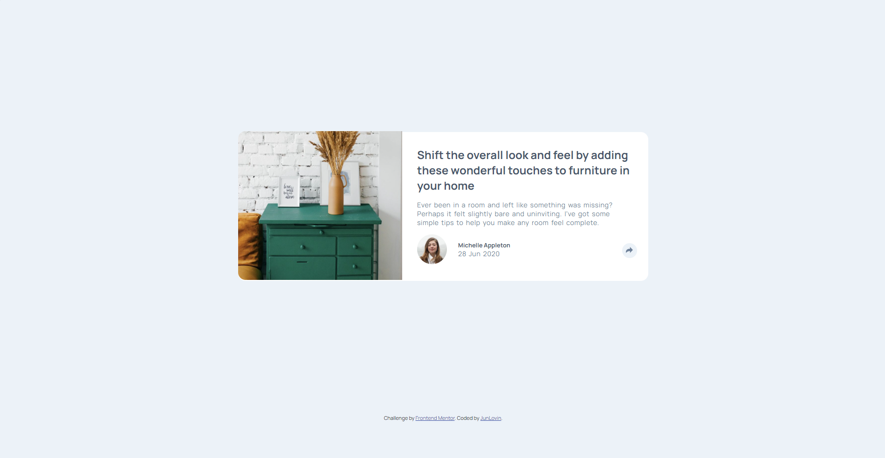

# Frontend Mentor - Article preview component solution

This is a solution to the [Article preview component challenge on Frontend Mentor](https://www.frontendmentor.io/challenges/article-preview-component-dYBN_pYFT). Frontend Mentor challenges help you improve your coding skills by building realistic projects. 

## Table of contents

- [Overview](#overview)
  - [The challenge](#the-challenge)
  - [Screenshot](#screenshot)
  - [Link](#link)
  - [Built with](#built-with)
- [Author](#author)

## Overview

### The challenge

Users should be able to:

- View the optimal layout for the component depending on their device's screen size
- See the social media share links when they click the share icon

### Screenshot

### Link

- Solution URL: [Add solution URL here](https://junlovin.github.io/Article-Preview)

### Built with

- Semantic HTML5 markup
- CSS custom properties
- Flexbox

## Author

- Website - [JunLovin](https://junlovin.github.io/Mathias)
- Frontend Mentor - [@JunLovin](https://www.frontendmentor.io/profile/JunLovin)
- Twitter - [@junlovin23](https://www.twitter.com/junlovin23)